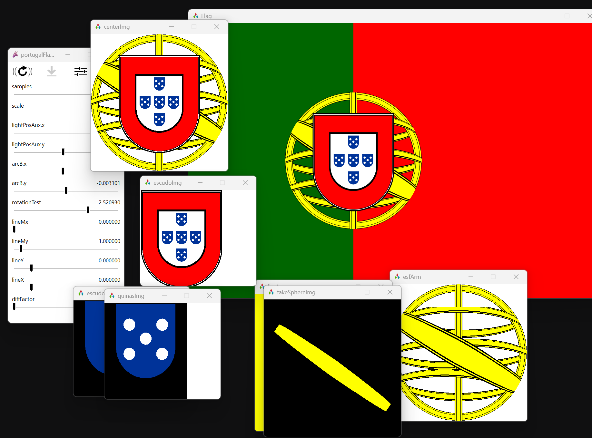

# Shadron GLSL Experiments Playground Repository

This repository contains a collection of experiments and little projects I did while in University, that explore the use of the Shadron tool with GLSL (OpenGL Shading Language).

## Experiments

Summary of current experiments:

- **Portugal Flag Shader 🇵🇹/**: WIP... Trying to recreate the complicated portuguese flag using only math.

- **Perlin Puddle Shader**: Implementation of a GLSL Loading Screen for a past scrapped project.

- **Circumference Shader**: Collection of shaders used in past side projects involving circumferences and music.

- **Outline Shader**: Implementation of an outline shader.

- **Gooch Shader**: Implementation of Gooch Shader https://en.wikipedia.org/wiki/Gooch_shading
- **Fake Sphere Shader**: Educational shader that creates the illusion of a sphere on a 2d plane.

## Shadron

Find out more about Shadron at: https://www.arteryengine.com/shadron/

## License

This repository is licensed under the [MIT License](LICENSE). Please refer to the license file for more information.

---